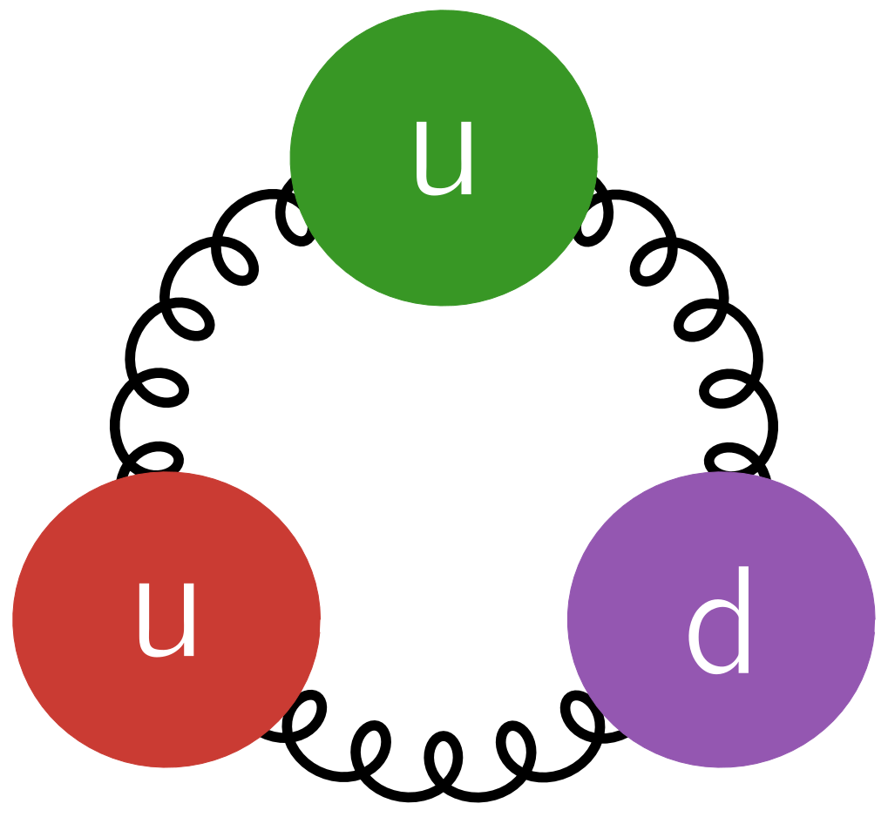

+++
title = "JuliaHEP"
+++

<!-- \toc -->

# JuliaHEP

[JuliaHEP](https://github.com/JuliaHEP/) is an informal organization that aims to unify effort
in developing Julia projects related to [high energy physics](https://en.wikipedia.org/wiki/Particle_physics).

## JuliaHEP Workshops

We organise annual workshops for the JuliaHEP community. These are a great place to present new projects and updates.

- [JuliaHEP Workshop 2024](https://indico.cern.ch/e/juliahep202/) at CERN
- [JuliaHEP Workshop 2023](https://indico.cern.ch/event/1292759/) at ECAP (Erlangen Centre for Astroparticle Physics)

## JuliaHEP Topical Meetings

We organise topical meetings on subjects of interest to the JuliaHEP community -
this can be a presentation on a new package, an update, or discussion of an
interesting problem.

- [JuliaHEP Topical Meeting Calendar](https://indico.cern.ch/category/16956/)

You are very welcome to propose a topic, just contact the [JuliaHEP
conveners](mailto:hsf-juliahep-organisation@googlegroups.com).

## Where to find us?

- Many of us are pretty active on the `#hep` channel of the [official Julia Slack
  workspace](https://julialang.org/slack/).
- For usage or language related questions, you should post to the official [Julia Discourse](https://discourse.julialang.org/) forum with the [hep tag](https://discourse.julialang.org/tag/hep).
- Low-frequency communication (e.g. annoucement) also happens on [Julia-HEP Google Group](https://groups.google.com/g/julia-hep/), the group is currently public.
- You can find our projects on Github, most hosted under the
  name-sake [JuliaHEP organization](https://github.com/JuliaHEP).

### HSF Working Group

JuliaHEP is also one of the activities of the HEP Software Foundation ([HSF](https://hepsoftwarefoundation.org/activities/juliahep.html)). All conveners of the working group can be reached at [hsf-juliahep-organisation@googlegroups.com](mailto:hsf-juliahep-organisation@googlegroups.com).

## Selected Publications and Talks

### Publications

- Marcel Stanitzki, Jan Strube "Performance of Julia for High Energy Physics Analyses" [inspire](https://inspirehep.net/literature/1788437)
- Oliver Schulz et al., "BAT.jl -- A Julia-based tool for Bayesian inference" [inspire](https://inspirehep.net/literature/1810548)
- Jonas Eschle et al., "Potential of the Julia programming language for high energy physics computing" [inspire](https://inspirehep.net/literature/2666479)

### HEP papers that used Julia

- "Studies of the double charmed tetraquark" by LHCb collaboration, [inspire](https://inspirehep.net/literature/1915358)
- "Studies of OmegacXX states by LHCb collaboration", [inspire](https://inspirehep.net/literature/1879440)
- Liupan An et al., [inspire](https://inspirehep.net/literature/1806437)
- M. Mikhasenko et al., "Pole position of the a1(1260) from τ-decay", [inspire](https://inspirehep.net/literature/1696497)
- L. Bibrzycki et al., "π p → η(')π− p in the double-Regge region", [inspire](https://inspirehep.net/literature/1859521)

### Talks

- Julia in HEP?, Computing in High Energy and Nucelar Physics Plenary, October 2024 [by Graeme A Stewart](https://indico.cern.ch/event/1338689/contributions/6009700/)
- Julia in high-energy physics: a paradigm shift or just another tool?, HSF Seminar, October 2024 [by Uwe Hernandez Acosta](https://indico.cern.ch/event/1452314/)
- Julia for HEP Computation (CoDaS-HEP/PyHEP 2023, [by Jerry
   Ling](https://indico.cern.ch/event/1293313/timetable/#11-hands-on-demo-session))
- Is Julia ready to be adopted by HEP? (CHEP2023, [by Tamás Gál](https://indico.jlab.org/event/459/contributions/11521/))
- High-performance end-user analysis in pure Julia programming language (CHEP2023, [by Jerry Ling](https://indico.jlab.org/event/459/contributions/11560/))
- Polyglot Jet Finding (CHEP2023, [by Graeme A Stewart](https://indico.jlab.org/event/459/contributions/11540/))
- Julia at the NHEP computing Round Table ([by Philippe Gras](https://indico.jlab.org/event/505/#day-2022-02-08))
- Status and outlook in 2021 ([by Jerry Ling](https://jiling.web.cern.ch/jiling/dump/2021_Harvard_JuliaHEP.html))
- PyHEP 2021: ([by Jan Stube](https://www.youtube.com/watch?v=WVpm6WXDYlA&ab_channel=HEPSoftwareFoundation), [by Philippe Gras](https://www.youtube.com/watch?v=ZoKX39Ha3YA&ab_channel=HEPSoftwareFoundation))
- JuliaCon 2021 ([by Misha Mikhasenko](https://www.youtube.com/watch?v=QlfAa-LN1SA&t=1s&ab_channel=TheJuliaProgrammingLanguage))
